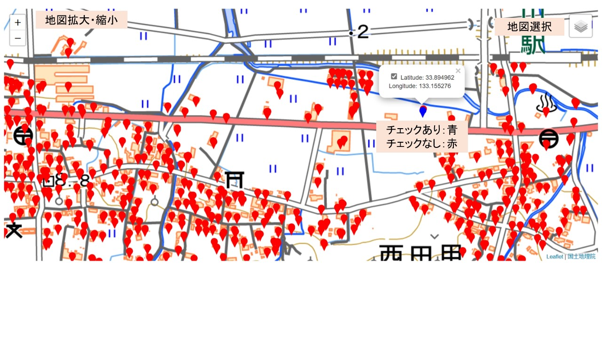

## 実行

### セットアップ（初回のみ）
setup.pyをダブルクリック
### アプリ実行
run.batをダブルクリック
### 画面表示表示（アプリ実行）
http://127.0.0.1:5000

## 表示画面

## 参照データ

### G空間
#### トップページ
https://front.geospatial.jp/
#### 西条市（松山地方法務局西条支局）登記所備付地図データ
https://www.geospatial.jp/ckan/dataset/houmusyouchizu-2023-1-1679